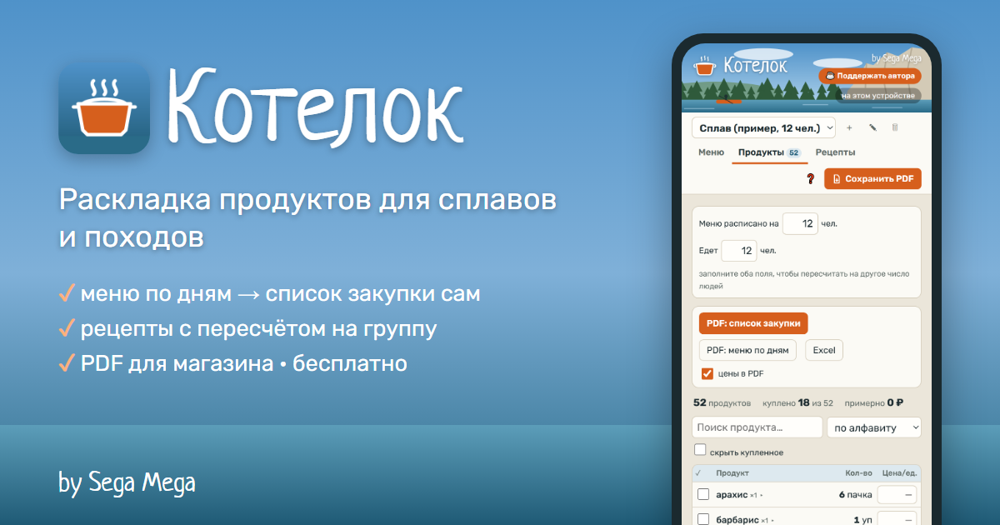
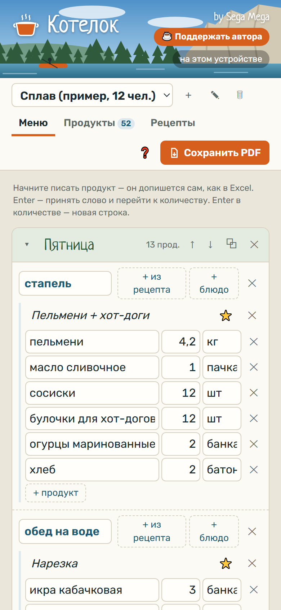
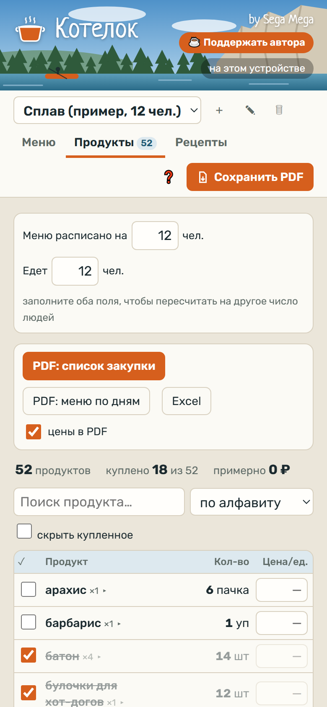
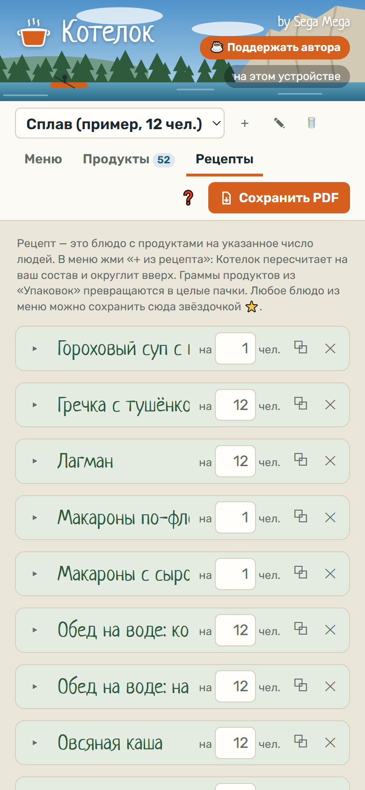

# 🍲 Котелок — раскладка продуктов для сплавов и походов

**Открыть приложение → [segapoz-dot.github.io/kotelok](https://segapoz-dot.github.io/kotelok/)**  
Бесплатно · без рекламы · работает на телефоне, компьютере и без интернета.

## Зачем

Раньше раскладку я считал в Excel: пишешь по дням завтрак, обед, ужин, потом вручную складываешь картошку с тушёнкой из десяти блюд. Котелок делает это сам:

- **Меню по дням** — завтрак, обед, ужин, перекус, «на катамаране» — как привыкли.
- **Список закупки собирается сам** — одинаковые продукты из всех дней складываются в одну строку.
- **Рецепты с пересчётом** — «Плов на 8 человек» — и рис, индейка, морковь, масло посчитаны и округлены вверх до целых пачек.
- **Подсказки как в Excel** — пишешь «ту…», допишется «тушёнка».
- **Цены и сумма**, галочки «купил» прямо в магазине.
- **PDF** — отдельно список закупки и меню по дням, можно печатать и кидать в чат.
- **Телефон + компьютер** — синхронизация через ваш Яндекс Диск (по желанию).

| Меню | Список закупки | Рецепты |
|---|---|---|
|  |  |  |

## Как поставить на телефон

**iPhone:** открой ссылку в Safari → «Поделиться» → «На экран Домой».  
**Android:** Chrome → ⋮ → «Добавить на главный экран».

Короткая памятка со стрелочками: **[как пользоваться за 7 шагов](https://segapoz-dot.github.io/kotelok/help.html)**.

## Где хранятся данные

На вашем устройстве. Если подключить Яндекс Диск — ещё и в папке «Приложения/Котелок» на **вашем** Диске. Автор приложения ваши данные не видит.

## История

Я не программист — хожу на сплавы и много лет считал раскладку в Excel на 12–13 человек. Котелок собран вместе с ИИ-ассистентом Claude: от моей таблицы до приложения на телефоне. Рецепты внутри — проверенные на наших сплавах.

## Поддержать

Если Котелок пригодился — [подкинь автору на тушёнку 🥫](https://yoomoney.ru/fundraise/1KPCEM94J3O.261008)

---

Придумал **Sega Mega** · Приятного аппетита! 😋
